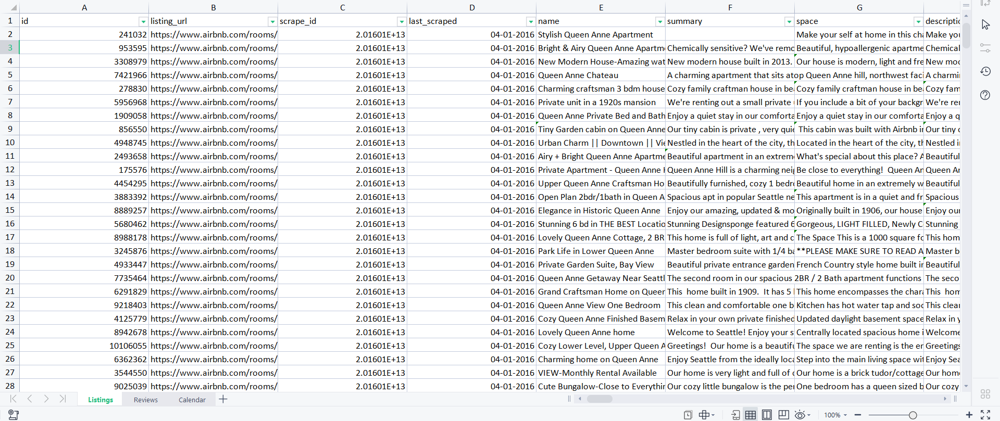
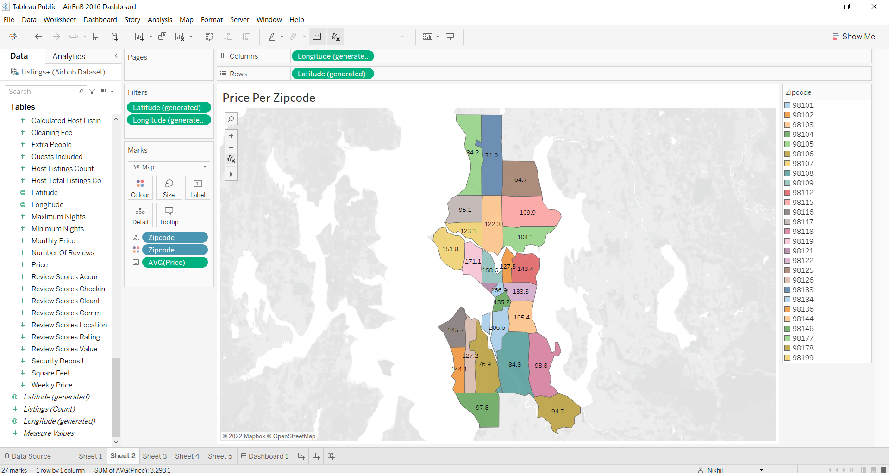

# Visualizing Airbnb listing 2016 Dataset using Tableau

## About AirBnB

Airbnb is an online community marketplace for people to list, discover, and book accommodations through mobile phones or the internet.

The company connects travelers seeking authentic experiences with hosts offering unique, inspiring spaces. Whether the available space is a castle for a night, a sailboat for a week, or an apartment for a month,Airbnb is the easiest way for people to showcase these distinctive spaces to an audience of millions. By facilitating bookings and financial transactions, Airbnb makes the process of listing or booking a space effortless and efficient.
With 4,500,000 listings in over 65,000 cities in 191 countries, the company offers the widest variety of unique spaces for everyone, at any price point around the globe.

The company was co-founded in August 2008 by Brian Chesky and Joe Gebbia, and is currently headquartered in San Francisco, California.

## Dataset Source - https://www.kaggle.com/datasets/alexanderfreberg/airbnb-listings-2016-dataset

This is AirBnB Public Listing 2016 Dataset to figure out the Average price per bedroom, Price by Zipcode, Revenue for year, Price per Zipcode, Distinct Count of Bedroom Listings and many more.

# Steps for analyzing and visualizing the dataset - 

1. Getting the data from the source with different csv's and put it together into one excel file.
2. Checking the data and knowing the terms what they mean, cleaning and organizing it properly.
3. Opening the combined excel file in tableau desktop, update automatically and open the listings on the data source.
4. Doing the join of listings and calendar table to match the id (listings : id == calendar : listing_id).
5. Now creating the tableau sheets for Dashboard.
6. Getting to know the insights of dataset with the help of tableau dashboard.

# The Combined Excel sheet has 3 CSV files name : Listings, Reviews and Calendar.

## Excel Files:

### Listings Dataset

### Reviews Dataset

### Calendar Dataset

# Data Visualizations of different tables.

### Different Questions According to Which the Dashboard is made out of.

## 1. How things affected, something that's going to affect the price of the actual airbnb and it's going to be the amount of bedrooms? 

## Average Price per Bedroom

The graph shows which ones are bringing the most money, as per the avg prices higher the bedroom more the money, only if you have good investment.

## 2. Listing on airbnb for the best time for people to be able to use, or when poeple are spending the most money in airbnb's?

## Revenue for Year

Average price for year graph shows summer and winter holidays are the best time to rent an airbnb to make money as a host.

## 3. Doing map for Seattle, USA.

## Average Price Per Zipcode

98184 Zipcode of USA has the highest Average Price -- Bank of America, Seattle, WA, USA
98125 Zipcode of USA has the lowest Average Price -- Victory Heights|Lake City, Seattle, WA, USA

## 4. How expensive each zipcode is? 

## Average Price by Zipcode

If i want to start an airbnb business, where i should go? 

Buy home put it on airbnb and start renting it out?

where is the best place? what factors to look for?

## 5. Looking at the renting competition.

## Distinct Count of Bedroom Listings

finding how many no. of bedrooms airbnb has competition and found out the more the no. of bedrooms the less is the competition.

# Tableau Dashboard made out of 5 sheets.

## More questions that can also be found out is - 

- weekly rent or monthly rent?
- highest rental location and lowest rental location?
- how many 5 star reviews people are giving?
- which is the best place to invest to rent an airbnb for max profit in which month or season?
- which is good, single, double or triple bedroom or more?
